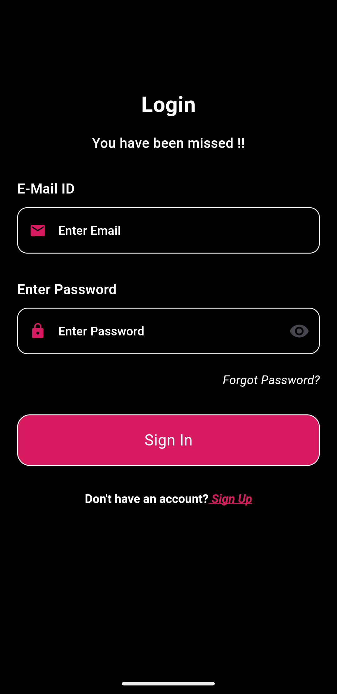
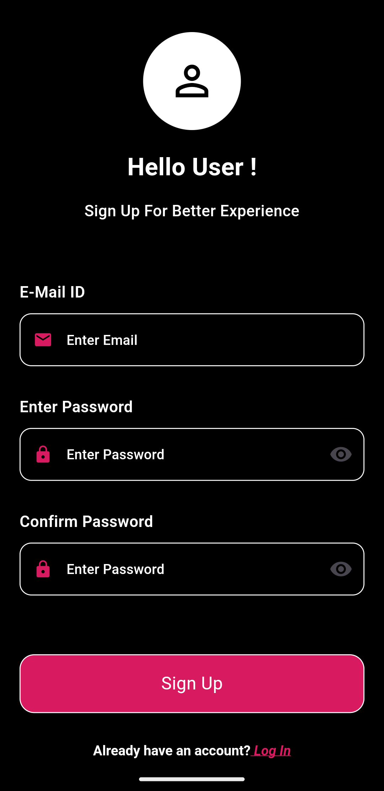
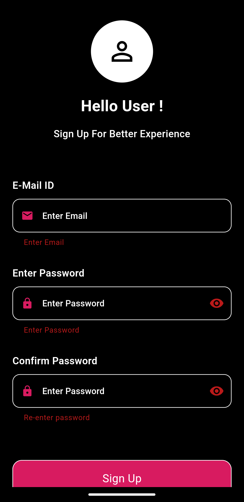

# 💱 Thoughtbox

Thoughtbox is a **Currency Converter** app built using **Flutter**, designed to work both **online** and **offline**.  
It provides real-time currency conversion rates and also caches the latest fetched data for offline use, ensuring a smooth experience even without an internet connection.

---

## 📸 Screenshots

<p float="left">
  
  
  
  
</p>

---

## 🎥 Demo Video

[▶ Watch on YouTube](https://youtube.com/shorts/4tEXDj4husk)

---

## 🚀 Features

- **Real-time Currency Conversion** – Fetches the latest exchange rates from API.
- **Offline Support** – Works even without an internet connection.
- **Data Caching** – Stores the most recent fetched rates in local storage using **Hive**.
- **API Failure Handling** – Falls back to cached values when the API fails.
- **Rate Expiry Check** – Warns if the rate is older than 5 minutes.

---

## ⚙ How Offline Mode Works

- When online, the app fetches live exchange rates from the API and **stores** them locally using **Hive**.
- If the same currency pair is requested within **5 minutes**, the app uses the **cached value** instead of making another API call.
- If the API request fails, the app will use the last cached value (if it is less than **30 minutes old**).
- If the cached value is older than **5 minutes**, the app shows a warning to the user.

---

## 🛠 Tech Stack

- **Flutter** – Frontend framework
- **Hive** – Local database for caching data
- **HTTP** – API calls
- **Provider / BLoC** – State management (depending on your architecture)

---

## 📦 Installation

1. **Clone the repository**
   ```bash
   git clone https://github.com/your-username/thoughtbox.git
   ```
